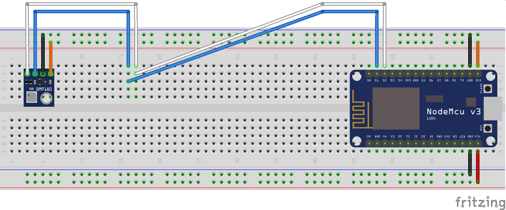
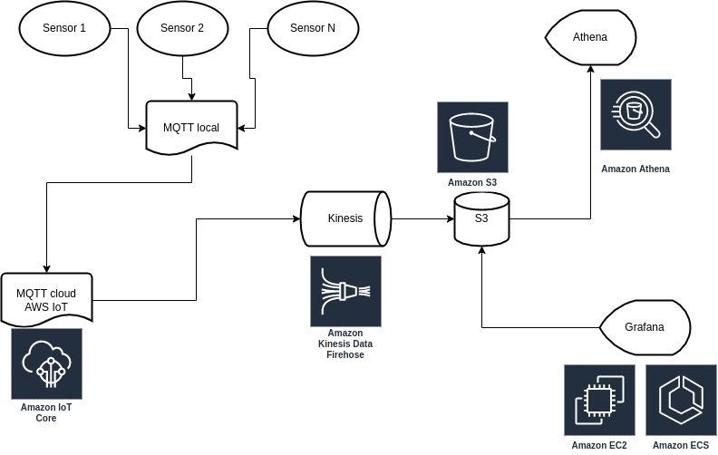

# ESP to AWS
The goal of this project is to show how easy it is to move data from your own hand-made device to the AWS cloud.

## Intro

This is to document the path I went to send and analyze data produced by my sensors in the Cloud. I have designed and run several environmental sensors measuring temperature and not only (air pressure and luminous intensity was also measured is one of them).

The easy way to get our sensor monitored and collected is to run an instance on Home Assistant, Node Red or even send sensor data to some dedicated web service for collecting its data. But how about if we collected it in the real Cloud? Take AWS for example. What benefits are there?

We can plug in our sensor data to AWS using their IoT service. Then data is open to be used in the whole AWS platform. 
we can leverage it’s notifications and services ecosystem to trigger various actions and even feed ML algorithms with sensor data
storage of data is impossible to overfill (S3)
easy way of plugging in live dashboard in any form (hosted as standalone apps deployed in Beanstalk or static websites in S3)
ability to query and process our data using SQL if we put it to the database or even used basic querying on S3 with Athena (that I will show you in this example).

## Hardware
In it’s richest format the device I use to measure environment features is built like that:


With BME180/280 it can measure not only temperature but humidity and air pressure as well.
There are also less complicated versions of my device, which contain only one DS18B20 sensor.

To communicate with MQTT broker, I have used my beloved ESP processor based boards (both ESP32 and ESP8266 in various items). 

## From a sensor to cloud
How does the signal traverse from my, say, BME180 sensor to the cloud? Of course, first it has to be read and sent to the local MQTT network. In my home setup, this network is currently managed by Raspberry Pi 4 with Mosquitto service up and running. The communication is done with easy MQTT libraries like in the example below

```cpp
#include <PubSubClient.h>
#include "secrets.h"
#include <ArduinoJson.h>

WiFiClient espClient;
PubSubClient client(espClient);

…

  StaticJsonDocument<200> doc;
  doc["temp"] = temp;
  doc["voltage"] = voltage;
  doc["device"] = deviceId;
  String channelName = "lukmqtt/sensor/"+deviceId;
  Serial.println("Sending to channel named "+channelName);
  client.publish(channelName.c_str(), msg);
```

When JSON with temperature reading is available on MQTT locally, I can use it e.g. for Home Assistant and do the dashboarding. But how to make it to the cloud?
I found MQTT functionality called bridging very convenient. I can connect 2 MQTT brokers together, so they exchange data on topics between each other. I can define if this connection should be one-way, both-ways and which topics are shared. The folliowing is exemplary snippet from `bridge.conf` file

```
connection awsiot

xxxxxxxxxxxxxxx-ats.iot.<region>.amazonaws.com:8883

topic lukmqtt/# out 1
```

AWS is a very extensive platform that gives you hosted MQTT broker, too - this is [so called AWS IoT Core](https://aws.amazon.com/iot-core/?c=i&sec=srv). So the most important step here I used is to bridge to make a local to cloud MQTT connection. I followed the instructions [from the official AWS Blog](https://aws.amazon.com/blogs/iot/how-to-bridge-mosquitto-mqtt-broker-to-aws-iot/). Check *How to Configure the Bridge to AWS IoT Core*  section only - I did not need to use EC2 in this regard. In general, it is enough to download some certificates from AWS and update *bridge.conf* entries - if you encounter issues let me know, I can help.
After we have bridged our MQTT networks, we should test it. And if you will test it, and it works we are ready to go, to use it in the cloud.

## Data in AWS

### Streaming
The service to use with streaming in AWS is Kinesis. It comes in 2 flavors - Data Streams and Firehose. In my use case I just wanted to query and collect data and I am not very into reacting with millisecond precision. In this case Firehose is enough - it can get your data from a stream and put into data storage and apply transformation on the way. The following is the general diagram for my sensors data management on AWS.



### Use loaded data
After data is put to the delivery stream it is stored on S3 - the regular storage for cloud. It gives a pretty cheap way of storing data.
In modern cloud Data Engineering we do not need to create big data warehouses with high cost upfront. The pretty neat way is to store files on the file service and use some techniques to transform data into the form that is easily queryable (f.e. convert JSON to Parquet files). This is called a **data lake**, and you can build one with S3 on AWS.
One way is to query it with Athena, which is a serverless service to execute SQL queries against file resources.

### Need to transform and visualize
Querying S3 files formatted as JSONs is doable, however this is not optimal for fast reading. There are much more efficient data formats that you can store your measurements into. One of the basic rules of data engineering is to store data in a way that it will be efficient for query patterns. 

My goal is to visualize temperatures of my sensors, this is why I created them. So how about creating simple graphs with X axis of time and Y axis representing Celsius values.

If our data is already cloud based we could leverage AWS-recommended BI tool - Quicksight. In my case however, I would like to avoid vendor lock-in and increase my knowledge of using Grafana, a free tool.  Grafana is the standard tool to do the time series monitoring.

I ran **Grafana** as an ECS service, however there are easier ways of running it - Managed Grafana Service. I was able however to run the Docker image to have full control of the service. Grafana comes with a nice plugin to connect to Athena. If you want to follow my steps with the Terraformed environment you need to run the task `grafana_service` and then do few Grafana-related activities:
- install Grafana Athena plugin
- add Athena source (using internal AWS SDK credentials as IAM policies are already configured)
- add Dashboard series, f.e. using such a query

```sql
select device, temp, cast(ts as timestamp) ts
from $__table
where device = 'temperature_office'
order by ts
```

## Infrastructure as Code
To implement the whole infrastructure in your AWS it’s enough to run terraform scripts, so there is no need to implement everything in the AWS console yourself. So no more clicking on windows and following instructions from screenshots. AWS CLI and Terraform is enough to run all modifications on your cloud environment. All services required from this project are possible to implement in your AWS environment with simple
```
terraform apply
```
You need to provide only few customizations:
- choose your region
- provide tf file with the variable "account_id"
- choose your project name and modify variables.tf file

If Terraform is used to implement changes it may be in the same easy way used to discard and undo them, because services used here will incur costs, so Free Tier can’t be leveraged here.